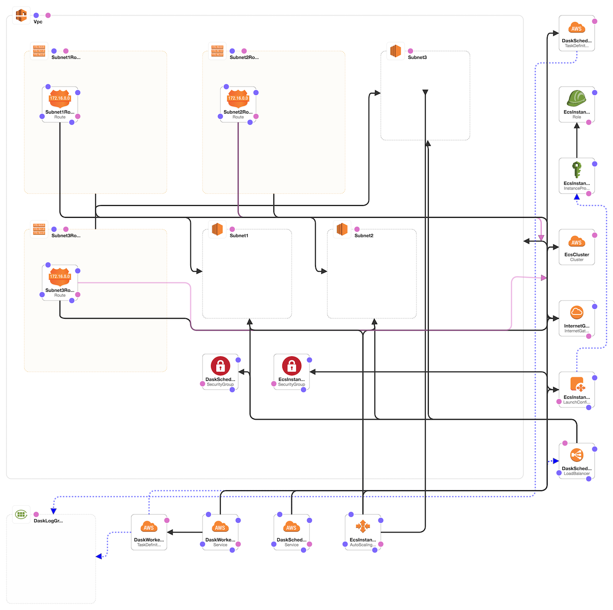

# Dask ECS

This is an opinionated template for spinning up a dask cluster based on docker.

## CloudFormation Topology




## Install

First clone this repo.

Then navigate to your [aws console cloudformation dash](https://console.aws.amazon.com/cloudformation) -> create stack -> choose a template -> Upload a template to Amazon S3 -> choose file -> then navigate to this dask-ecs-template.yaml file.  In the web portal you can configure to your liking.

## Parameters

```
EC2InstanceType:
  Type: String
  Description: EC2 instance type (generally m4.x for non cuda ami; p2.x for cuda ami)
  Default: m4.large

EC2KeyPairName:
  Type: AWS::EC2::KeyPair::KeyName
  Description: Used for ssh access to ec2 instances, create in ec2 dash -> key pairs

ClusterSize:
  Type: Number
  Description: Number of nodes in the cluster
  Default: 3

DaskSchedulerImage:
  Type: String
  Description: Docker image with dask scheduler, must be runnable with command `dask-scheduler`
  Default: sayreblades/dask-ecs:python35-nolearn

DaskWorkerImage:
  Type: String
  Description: Docker image with dask worker, must be runnable with command `dask-worker [host] --worker-port [port]`
  Default: sayreblades/dask-ecs:python35-nolearn

EBSVolumeSize:
  Type: Number
  Description: Size of EC2 Disk Volume in gigs
  Default: 50
```

## Example Docker Scheduler

https://hub.docker.com/r/sayreblades/dask-ecs/


## Example Docker Worker

https://hub.docker.com/r/sayreblades/dask-ecs/


## Example client

```
from dask import bag as db
import distributed


client = distributed.Client(address="[YourDaskServer:Port]")
b = db.from_sequence([1, 2, 3, 4, 5, 6])
c = b.map(lambda o: o*2)
f = client.compute(c)
f.result()
```

## Logs

Creates logs in cloud watch.  The log group name will be the name you gave the cloud formation stack.

To view logs use the cloudwatch web interface or awslogs: https://github.com/jorgebastida/awslogs

```
awslogs get [log group name] -w
```

## Similar Projects

- https://hub.docker.com/r/magsol/distributed-dask/

- https://github.com/ogrisel/docker-distributed


## Warnings

- The cluster is wide open in terms of network connectivity.  Use at your own risk.

- The current configuration uses a custom ami image (ami-2505a35f) which is only available in us-east-1 region.

- If you are using the p2.x class of machines for your cluster, you may need to request a resource limit increase
  based on your region: http://docs.aws.amazon.com/AWSEC2/latest/UserGuide/ec2-resource-limits.html

- If you are attempting to use dask locally, you should take care that your local python dependencies exactly
  match the versions deployed to the cluster.  One convention Im using to manage this is by maintaining a
  requirements.txt file associated with each docker container.
  See https://github.com/SayreBlades/dask-ecs/tree/master/dockerfiles/python35
  Which was used to build the container: sayreblades/dask-ecs:python35

## Notes

For building AMI's for use with ECS... putting these here for future reference:

https://stackoverflow.com/questions/39018180/aws-ecs-agent-wont-start
http://docs.aws.amazon.com/AmazonECS/latest/developerguide/ecs-agent-install.html
http://docs.aws.amazon.com/AmazonECS/latest/developerguide/launch_container_instance.html


For building GPU (p2.xlarge) instance on ecs:

https://github.com/bfolkens/nvidia-docker-bootstrap


## TODO

- add optional security
- add a cuda ready image for each region
